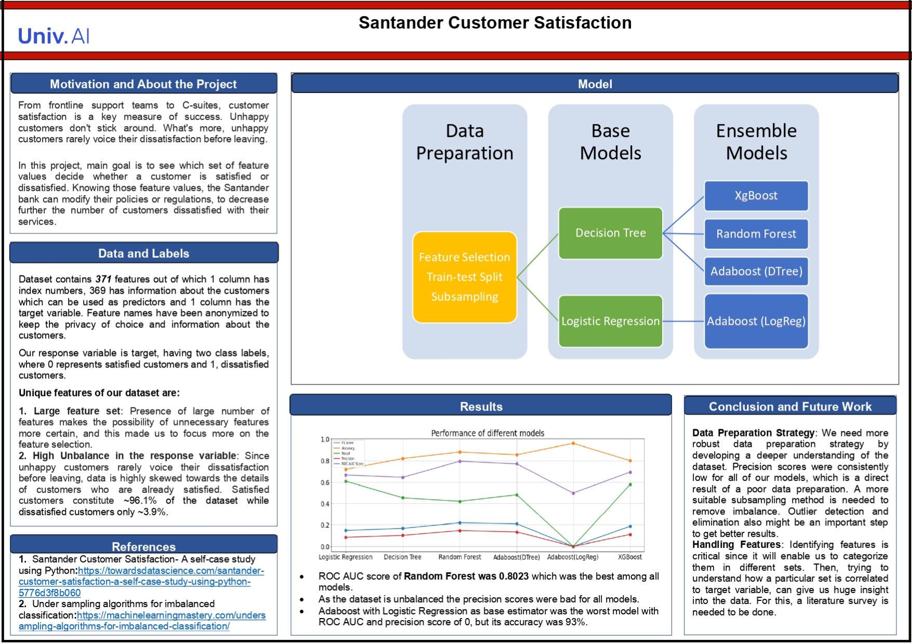

# Santander Customer Satisfaction Prediction

## Project Overview

This project aims to predict customer satisfaction for Santander bank using various machine learning techniques. The goal is to identify dissatisfied customers early, allowing the bank to proactively address issues and improve customer retention.

## Dataset

- **Size**: 371 features, 1 target variable
- **Target**: Binary classification (0 = satisfied, 1 = dissatisfied)
- **Class Distribution**: Highly imbalanced (~96% satisfied, ~4% dissatisfied)
- **Feature Reduction**: From 371 to 160 features after preprocessing

## Methodology

### Data Preprocessing

- **Null Value Handling**: No null values found
- **Feature Removal**:
  - 222 sparse features removed
  - 42 duplicate features dropped
  - 133 highly correlated predictors (>90% correlation) eliminated
- **Class Imbalance**: Addressed using SMOTE oversampling followed by undersampling

### Feature Selection

- t-value & p-value based selection for Logistic Regression
- Feature importance for Decision Tree and Random Forest
- Permutation importance for Random Forest

### Models Implemented

1. Logistic Regression (base model)
2. Decision Tree Classifier
3. Random Forest Classifier
4. AdaBoost Classifier
   - With Decision Tree base estimator
   - With Logistic Regression base estimator
5. XGBoost Classifier

### Evaluation Metrics

- Primary: ROC AUC Score
- Secondary: Precision
- Note: Accuracy was deprioritized due to class imbalance

## Results

- **Best Performing Model**: Random Forest
  - ROC AUC Score: 0.8023
- **Insights**:
  - Ensemble models outperformed base models
  - High accuracy didn't always correlate with good performance (e.g., AdaBoost with Logistic Regression)

## Key Challenges

1. **Class Imbalance**: Significantly affected model performance and choice of evaluation metrics
2. **Feature Selection**: Large number of initial features required careful selection and engineering
3. **Model Evaluation**: Choosing appropriate metrics for an imbalanced dataset

## Conclusions

- Data preparation is crucial for imbalanced datasets
- Ensemble models showed better performance, particularly Random Forest
- ROC AUC score and precision are more relevant metrics than accuracy for this imbalanced dataset

## Future Improvements

1. **Enhanced Data Preparation**:
   - Explore more robust techniques for handling imbalance
   - Implement outlier detection and elimination
2. **Advanced Feature Handling**:
   - Deeper analysis of feature contribution to the target variable
   - Categorize features into sets for better understanding of their impact
3. **Model Optimization**:
   - Fine-tune hyperparameters for ensemble models
   - Explore other advanced algorithms (e.g., Neural Networks, SVM)

## Tools and Technologies

- Python
- Libraries: Pandas, NumPy, Scikit-learn, Matplotlib, Seaborn, Imbalanced-learn, XGBoost

## References

1. [Santander Customer Satisfaction: A self-case study](https://towardsdatascience.com/santander-customer-satisfaction-a-self-case-study-using-python-a77643803f01)
2. [Under sampling algorithms for imbalanced classification](https://machinelearningmastery.com/undersampling-algorithms-for-imbalanced-classification/)

---

This project demonstrates a comprehensive approach to a real-world machine learning problem, addressing challenges like class imbalance and feature selection in a large dataset. It showcases skills in data preprocessing, model selection, and performance evaluation in the context of customer satisfaction prediction.
 
 

